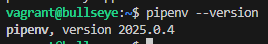
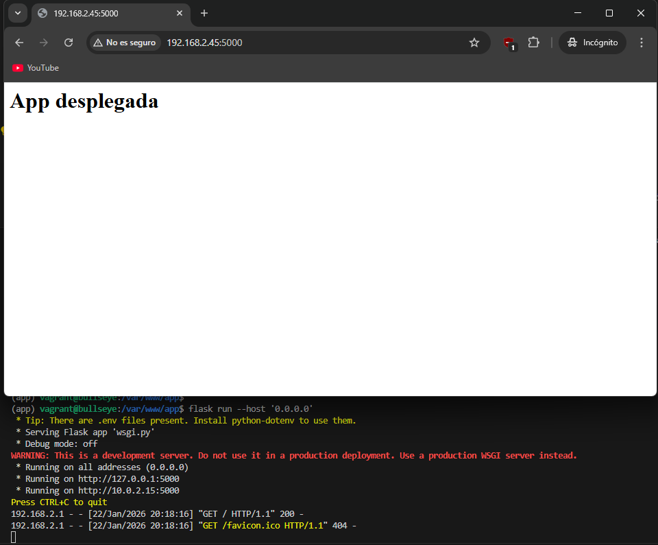

# Práctica Despliegue de aplicaciones Python con Flask y Gunicorn

## Sumario:

1. Instalación de prerequisitos
2. Creación de la aplicación Flask
3. Configuración de Gunicorn y Systemd
4. Configuración de Nginx y DNS
5. Tarea de Ampliación
6. Despliegue automatizado con Vagrant

## 1. Instalación de prerequisitos

Para comenzar con la práctica, necesitamos instalar el gestor de paquetes de Python y la herramienta `pipenv` que nos servirá para manejar los entornos virtuales. Primero actualizamos la lista de repositorios y luego instalamos los paquetes:

```
sudo apt-get update && sudo apt-get install -y python3-pip
pip3 install pipenv
pip3 install python-dotenv
```

Una vez instalado, comprobamos que tenemos la versión correcta de `pipenv`:

```
pipenv --version
```

Como vemos en la captura, se ha instalado correctamente y podemos ver su versión:



## 2. Creación de la aplicación Flask

A continuación, preparamos el directorio donde alojaremos nuestra aplicación. Vamos a usar la ruta `/var/www/app`. Es importante asignar los permisos adecuados a nuestro usuario y al grupo `www-data` para evitar problemas de permisos con el servidor web.

```
sudo mkdir -p /var/www/app
sudo chown -R vagrant:www-data /var/www/app
sudo chmod -R 775 /var/www/app
```

Dentro del directorio, creamos un archivo `.env` donde definimos las variables de entorno necesarias para Flask:

```
FLASK_APP=wsgi.py
FLASK_ENV=production
```

Ahora iniciamos el entorno virtual e instalamos las librerías `flask` y `gunicorn`:

```
cd /var/www/app
pipenv shell
pipenv install flask gunicorn
```

Creamos los archivos `application.py`, que contendrá la lógica de la aplicación, y `wsgi.py`, que servirá como punto de entrada.

El fichero `application.py` queda así:

```
from flask import Flask

app = Flask(__name__)

@app.route('/')
def index():
    '''Index page route'''
    return '<h1>App desplegada</h1>'
```

Y el fichero `wsgi.py` así:

```
from application import app

if __name__ == '__main__':
   app.run(debug=False)
```

Para verificar que todo funciona antes de seguir, lanzamos el servidor de desarrollo de Flask:

```
flask run --host '0.0.0.0'
```



También probamos a lanzarlo directamente con Gunicorn para asegurarnos de que el servidor de aplicaciones responde bien:

```
gunicorn --workers 4 --bind 0.0.0.0:5000 wsgi:app
```


## 3. Configuración de Gunicorn y Systemd

Para que nuestra aplicación funcione como un servicio del sistema y arranque automáticamente, creamos un archivo de unidad en systemd. Editamos el fichero `/etc/systemd/system/flask_app.service`:

```
[Unit]
Description=flask app service
After=network.target

[Service]
User=vagrant
Group=www-data
Environment="PATH=/home/vagrant/.local/share/virtualenvs/app-1lvW3LzD/bin"
WorkingDirectory=/var/www/app
ExecStart=/home/vagrant/.local/share/virtualenvs/app-1lvW3LzD/bin/gunicorn --workers 3 --bind unix:/var/www/app/app.sock wsgi:app

[Install]
WantedBy=multi-user.target
```

Luego recargamos `systemd` y habilitamos el servicio:

```
sudo systemctl daemon-reload
sudo systemctl enable flask_app
sudo systemctl start flask_app
```

## 4. Configuración de Nginx y DNS

Ahora configuramos Nginx para que haga de proxy inverso, redirigiendo las peticiones al socket de Gunicorn. Creamos el archivo `/etc/nginx/sites-available/app.conf` con el siguiente contenido:

```
server {
  listen 80;
  server_name app.izv www.app.izv;

  access_log /var/log/nginx/app.access.log;
  error_log /var/log/nginx/app.error.log;

  location / {
    include proxy_params;
    proxy_pass http://unix:/var/www/app/app.sock;
  }
}
```

Activamos el sitio creando el enlace simbólico y reiniciamos el servidor Nginx:

```
sudo ln -s /etc/nginx/sites-available/app.conf /etc/nginx/sites-enabled/
sudo nginx -t
sudo systemctl restart nginx
```

Para poder acceder por nombre, editamos el archivo `hosts` de nuestra máquina anfitriona añadiendo la IP de la máquina virtual:

```text
192.168.2.45 app.izv www.app.izv
```

Si accedemos al navegador, vemos que la aplicación está desplegada correctamente:


## 5. Tarea de Ampliación

En esta parte vamos a realizar el mismo proceso pero desplegando una aplicación real desde GitHub.

1.  Clonamos el repositorio del ejemplo de Azure en `/var/www`:

    ```
    cd /var/www
    git clone https://github.com/Azure-Samples/msdocs-python-flask-webapp-quickstart
    ```

2.  Entramos en el directorio, activamos el entorno e instalamos los requisitos:

    ```
    cd msdocs-python-flask-webapp-quickstart
    pipenv shell
    pipenv install -r requirements.txt
    ```

3.  Creamos el archivo `wsgi.py`:

    ```
    from app import app

    if __name__ == "__main__":
        app.run()
    ```

4.  Probamos que arranca correctamente con Gunicorn:

    ```
    gunicorn --workers 4 --bind 0.0.0.0:5000 wsgi:app
    ```

5.  Finalmente, repetimos los pasos de configuración del servicio systemd y Nginx adaptando las rutas a esta nueva carpeta.

Como se ve en la imagen, la aplicación de ampliación funciona perfectamente:


## 6. Despliegue automatizado con Vagrant

Para realizar el despligue automatizado con Vagrant, he implementado directamente en el Vagrantfile todo el proceso de despliegue que hemos realizado aquí, por lo que tan sólo con ese fichero al lanzar la máquina Vagrant ya tendremos todo listo. Se puede hacer también con un fichero .sh aparte, pero elegí este método para simplificarlo todo.
